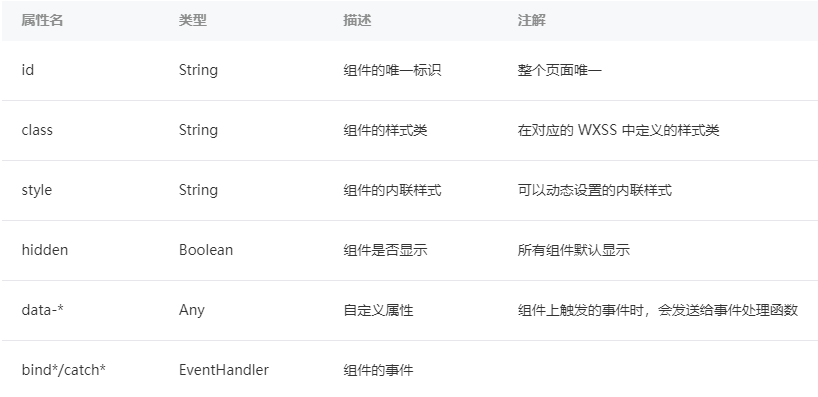

# 小程序的骨架—WXML


## 数据绑定

基本语法和 vue 非常的类似：

```js
// index.js
// 获取应用实例
const app = getApp()

Page({
  data: {
    name : "张三",
    time : (new Date()).toString()
  },
})
```

```wxml
<view>
  <text>我的名字是：{{name}}</text>
</view>
<view>
  <text>当前时间：{{time}}</text>
</view>
```

undefined值不会被输出到 wxml 中


在猫须语法中（ {{ }} ），是支持表达式的，这一点和 vue 也是相同的

例如：

```js
<text>{{ a > b ? "Hello" : "world"}}</text>
<text>{{ a + b }}</text>
```


## 条件逻辑

基本上也就是和 vue 是相同的，只不过需要注意语法上面的区别。

- wx:if
- wx:elif
- wx:else

例如：

```wxml
<view wx:if="{{age > 18}}">
  <text>可以进入网吧</text>
</view>
<view wx:elif="{{ age===18 }}">
  <text>刚好到能够进入网吧的年龄</text>
</view>
<view wx:else>
  <text>不能进入网吧</text>
</view>
```

block 有点类似于 vue 里面的 tempalte，表示要渲染的一整块内容。

```wxml
<block wx:if="{{age>18}}">
  <view>
    <text>{{ a > b ? "Hello" : "world"}}</text>
    <text>{{ a + b }}</text>
  </view>
  <view>
    <text>当前时间：{{time}}</text>
  </view>
</block>
```


## 列表渲染

基本上也是和 vue 是相同的，使用的是 wx:for

相比 v-for，在 wx:for 中已经将下标和迭代的元素变量默认确定好了，下标对应的是 index，迭代的每一项为 item

（在组件上使用 wx:for 控制属性绑定一个数组，即可使用数组中各项的数据重复渲染该组件。默认数组的当前项的下标变量名默认为 index，数组当前项的变量名默认为 item）

使用 wx:for-item 指定数组当前元素的变量名，使用 wx:for-index 指定数组当前下标的变量名

例如：

```wxml
<view wx:for="{{fruits}}" wx:key="index">
  <text>{{index}}</text> - <text>{{item}}</text>
</view>
```

```js
Page({
  data: {
    ...
    fruits : ["苹果","香蕉","哈密瓜"]
  },
})
```

注意，在进行列表渲染的时候，和 v-for 一样，也是需要添加 key，通过 wx:key

wx:key 的值以两种形式提供：

字符串，代表在 for 循环的 array 中 item 的某个 property，该 property 的值需要是列表中唯一的字符串或数字，且不能动态改变。

保留关键字 this 代表在 for 循环中的 item 本身，这种表示需要 item 本身是一个唯一的字符串或者数字


## 定义模板和引入模板

定义模板通过 template，使用 name 来设置模板的名称，模板中可以使用猫须语法接收动态的数据


```wxml
<template name="msgItem">
  <view>
    <text>{{index}} : {{ msg }}</text>
    <view>Time : {{ time }}</view>
  </view>
</template>
```

引入模板的时候，可以使用 import 和 include

例如下面是使用 import 来引入模板

import 可以在该文件中使用目标文件定义的 template

```wxml
<import src="../../templates/msgItem"/>
```

在使用的时候通过 is 属性来指定模板的名称，并且通过 data 属性来传入模板所需要的数据

```wxml
<template is="msgItem" data="{{index : 1, msg: '你好', time:'2023.1.10'}}"></template>
```

> 注意，在使用 import 引入模板的时候，有一个作用域相关的问题，详细请参阅文档。

需要注意的是 import 有作用域的概念，即只会 import 目标文件中定义的 template，而不会 import 目标文件中 import 的 template，简言之就是 import 不具有递归的特性。


还可以 include 来引入模板，这种方式一般适用于静态模板，做的实际上就是一个简单的替换操作。

<!-- include 可以将目标文件中除了 ***<template/> <wxs/>*** 外的整个代码引入，相当于是拷贝到 include 位置 -->

```wxml
<view>
  <text>这是一个头部</text>
</view>
```

```wxml
<view>
  <text>这是一个页尾</text>
</view>
```

```wxml
<include src="../../templates/header"/>

// ....

<include src="../../templates/footer"/>
```


整个 wxml 并不难，如果你有 vue 的编程经验，那么上手会更加轻松。

更多关于 wxml 的内容，请参阅：*https://developers.weixin.qq.com/ebook?action=get_post_info&docid=000ee2c29d4f805b0086a37a254c0a*


所有wxml 标签都支持的属性称之为共同属性

